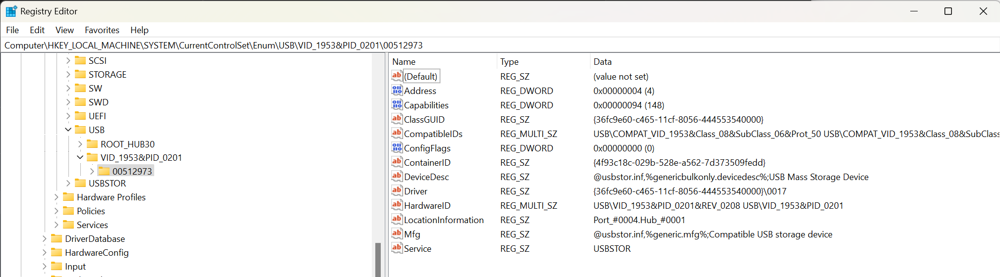

# USB Device Enumeration Key

## `HKEY_LOCAL_MACHINE\SYSTEM\CurrentControlSet\Enum\USB\`

We start the search for USB devices in the Windows registry. There is a key `HKEY_LOCAL_MACHINE\SYSTEM\CurrentControlSet\Enum\USB\` which handily contains a list of the enumerated devices.  Whilst many papers including ([H. Carvey and C. Altheide, “Tracking USB storage: Analysis of windows artifacts generated by USB storage devices”](https://www.sciencedirect.com/science/article/abs/pii/S1742287605000320?via%3Dihub)) start in the [USBStor key](USB%20Storage%20Enumeration%20Key.md) we are interested in starting at the device level. Whilst this theoretically should contain all devices it is possible to remove them from this key, either by rebuilding the registry or by malicious code. We will take this as a starting point, but will want further confirmation from other sources.

The first level of subkey is the **DeviceTypeId** this is generally a VendorID and ProductID (see below highlighted in green). However there may be a `ROOT_HUB30` key which contains the Root USB Hub to which all other device connect.

Under this DeviceTypeId key there is another key which is the **DeviceInstanceID** (highlighted below in blue). If the protocol and the provided device descriptor allow this will be the device's serial number. If either the protocol does not support serial numbers, or non was provided in the device descriptor, Windows will step in and generate one. This Windows generated DeviceInstanceID will have a `&` symbol as the second character. (see [H. Carvey, Windows Registry Forensics: Advanced Digital Forensic Analysis of the Windows Registry, 2nd ed. Syngress](https://www.sciencedirect.com/book/9780128032916/windows-registry-forensics), p. 91). See [Microsoft - Device instance ID](https://learn.microsoft.com/en-gb/windows-hardware/drivers/install/device-instance-ids) for further details.

> Note: this Image of the registry has been manipulated to remove sensitive data, and only shows the relevant keys.

## Important values

* **ContainerID** This GUID is the key use to refer to this physical device in the registry. This is used to consolidate multi-function devices into a single device container, and so all the individual device will use the same containerID. See [Microsoft - USB ContainerIDs in Windows](https://learn.microsoft.com/en-us/windows-hardware/drivers/usbcon/usb-containerids-in-windows) and how they are assigned [Microsoft - How USB Devices are Assigned Container IDs](https://learn.microsoft.com/en-us/windows-hardware/drivers/install/how-usb-devices-are-assigned-container-ids). In the pictured example the value is `{4f93c18c-029b-528e-a562-7d373509fedd}`
* **HardwareID** This collection of string contains the VendorID, ProductId, Revision, and InterfaceIDs. See [Microsoft - Standard USB identifiers](https://learn.microsoft.com/en-us/windows-hardware/drivers/install/standard-usb-identifiers)
    * **VendorID (VID)** This 4-digit Hexadecimal number represents the vendor. This value is controlled by the USB Implementers Forum and a list of all valid values can be found [here](https://www.usb.org/developers ). In the pictured example this is `0x1953`
    * **ProductID (PID)** This is a 4-digit Hexadecimal number represents the product, this is not controlled externally and is set by the vendor. There are some lists which have mapped many of these but there is no definitive list. In the pictured example this is `0x0201`
    * **Revision (REV)** This is a 4-digit Hexadecimal revision code provided by the vendor. This is often used to represent either the firmware or version of a device. Note that this revision is present in the HardwareID but not in the DeviceTypeID. The pictured example has a value of `0x0208`.
    * **InterfaceID (MI)** this is represented by a 2-digit Hexadecimal number indicating the 0-based index of the interface. This is not specified in the image as this only applies to multiple-interface USB devices see [Microsoft - Standard USB identifiers](https://learn.microsoft.com/en-us/windows-hardware/drivers/install/standard-usb-identifiers#multiple-interface-usb-devices)
* **Service** This is the windows service which is registered this device, for USB storage devices this will be `USBSTOR`
* **Mfg** This key occasionally contains a user-friendly name for the manufacturer, but is often not useful as there are other keys which will must contain the vendor name.

Next onto the [USB Storage Enumeration Key](USB%20Storage%20Enumeration%20Key.md)
