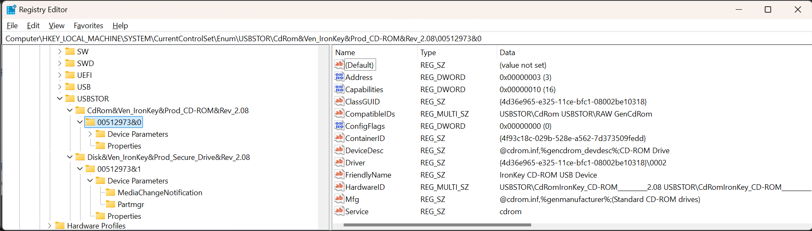
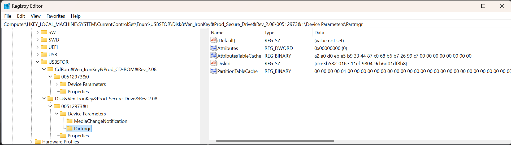

# USB Storage Enumeration Key

In the previous page we looked at the [USB Device Enumeration key](USB%20Device%20Enumeration%20Key.md), now we are looking at the storage devices.

## `HKEY_LOCAL_MACHINE\SYSTEM\CurrentControlSet\Enum\USBStor\`

## Important Values

* **StorageTypeId** this is generated by USBSTOR.SYS see [Microsoft - Identifiers Generated by USBSTOR.SYS](https://learn.microsoft.com/en-us/windows-hardware/drivers/install/identifiers-generated-by-usbstor-sys)
    * **DeviceType** This is the first part, it is the SCSI Device Type. See [Microsoft - Identifiers Generated by USBSTOR.SYS](https://learn.microsoft.com/en-us/windows-hardware/drivers/install/identifiers-generated-by-usbstor-sys)
    * **VendorName** This is a string (terminated with `&`, maximum 8 characters) which is the short name for the vendor `IronKey` in the examples.
    * **ProductName** This is a string (terminated with a `&`, maximum 16 characters) which is the name of the product. `CD-ROM` in the first example, and `Secure_drive` in the second example.
    * **RevisionName** This is a string (maximum 4 characters ) which is a revision name. This is `2.08` in the examples.
* **StorageInstanceID** This is the `DeviceInstanceId` of the device with a `&` and a 0 based **StorageItemId**. This allows each device to contain a number of storage items.
* **ContainerID** This GUID is the key use to refer to this physical device, which is the parent of this storage item. This is used to consolidate multi-function devices into a single device container, and so all the individual device will use the same containerID. See [Microsoft - USB ContainerIDs in Windows](https://learn.microsoft.com/en-us/windows-hardware/drivers/usbcon/usb-containerids-in-windows) and how they are assigned [Microsoft - How USB Devices are Assigned Container IDs](https://learn.microsoft.com/en-us/windows-hardware/drivers/install/how-usb-devices-are-assigned-container-ids). In the pictured example the value is `{4f93c18c-029b-528e-a562-7d373509fedd}` This matches the `ContainerID` we found in the [USB Device Enumeration key](USB%20Device%20Enumeration%20Key.md)
* **Friendly Name** This is sometimes present and is a user friendly name for this storage item.
* **Mfg** The manufacturer name, this is often not populated, and has a default value.
* **Service** The SCSI service which determines what type of drive it is.

## SubKeys

Any device which has a service of type `disk`, will have a subkey `Device Parameters\Partmgr`, this registry key contains a useful property.

* **DiskId** This is the ID of the disk associated with this storage item.

## Multiple USB Storage Enumeration Entries What is going on?

Yes we have found two entries in the USB Storage key. This is because we are looking at a IronKey S200 device which has an unlock tool which appears as a CD-ROM drive, and then an AES-256 Encrypted Memory drive. This is not a Multi-Interface device but has two different storage items attached to it.

## Joining it together

* The safest way to join this data together is to use the `ContainerID` in the USB Device Enumeration, and ensure it matches the `ContainerID` in USB Storage Enumeration.
* This is a one (Enum\USB entry) to many (Enum\USBStor entries).

This matches up with expectations so far. This is further reinforces as the serial numbers in the `StorageInstanceID` matches the one in the `DeviceInstanceId`.